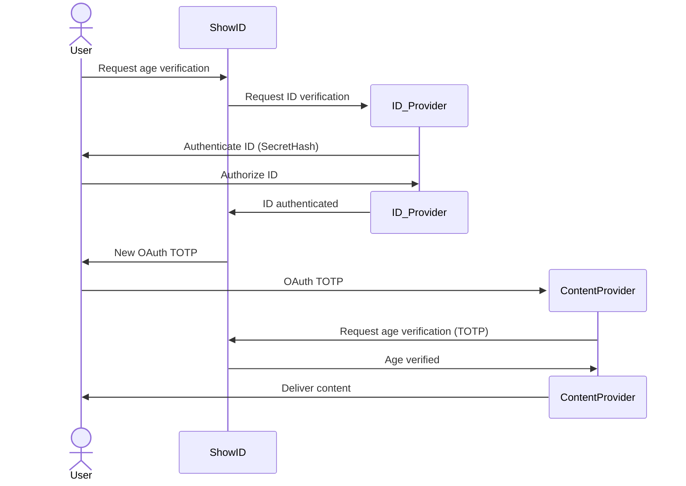

# ShowID

Thoughts on an open age-verification system

## Problem description

There is a lot of content on the internet that is not suitable for minors. People focus on porn,
but other content might be better kept out of children reach. Violence, self-harm and drugs is not
exactly the kind of content you want your teenage children to watch.

There is also the opposite problem. Forums and other spaces for children should not be accessed
by people over certain age.

## Features of an ideal solution

An age verification system must:

- provide robust age verification.
- be convenient.
- provide age verification for different scenarios:
  adult content, safe spaces and even surveils.
- not provide personal information to content providers/banks/advertisers.
  They already have your IP and fingerprinted web browser. What else do they want?
- not allow wholesale surveillance.
- allow traceability for law enforcement.
  If someone was posting/downloading illegal content, it should be possible to identify them.

## Existing Alternatives

The UK introduced age verification for porn, what caused some backlash because of the reduced
privacy and anonymity. There are some verification methods currently available:
- Credit card.
- ID.
- Guess age using selfie.

### Credit card

Make a purchase for 1 penny or some very small value.

Pros:
- Safe with strong anti-fraud infrastructure.

Cons:
- You have to give your credit card info to not-that-trustworthy websites.
- Your credit company gets to know what kind of adult content you consume.
- Your porn provider gets to know your name and address.
- Cannot stop adults to access spaces for children.

### ID

Send a copy of your physical ID to a verification company.

Pros:
- I can't think of any.

Cons:
- Some random company gets a copy of your ID.
- Everybody gets to know what kind of adult content you consume.
- Your porn provider gets to know your name and id-number.

### Photo with age guessing

Pros:
- You don't have to disclose personal details.

Cons:
- Random company keeps a copy of your selfie.
- Useless for people close to the arbitrary age limit that we are trying to enforce.
- [Low-effort bypass](https://www.forbes.com/sites/paultassi/2025/07/31/the-uks-internet-age-verification-is-being-bypassed-by-death-stranding-2-garrys-mod/).

## Solution using standard protocols

### A three-party system

Personal information is split between ShowID, ID_Provider, and ContentProvider.

To preserve anonymity, ShowID should never log any details when verifying User's ID, nor when
providing User's age verification.
